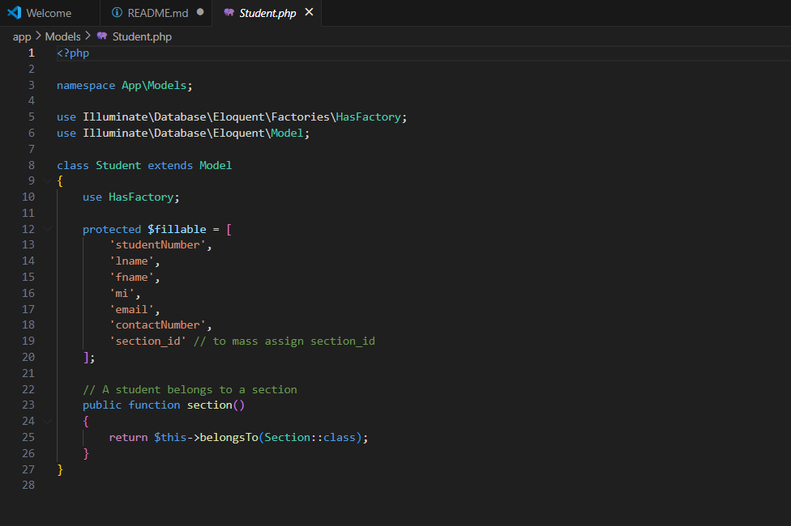
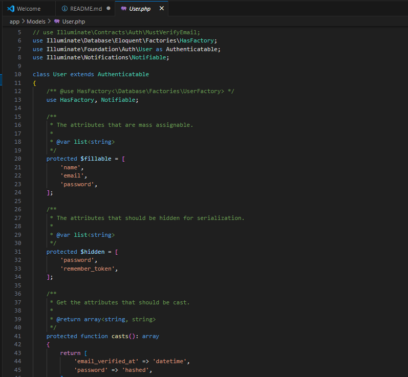

# 🧩 MyApp - Student and Section Management System

## 📘 Description / Overview
**MyApp** is a web-based system built using **Laravel** that allows users to efficiently manage students and sections.  
It provides features for adding, viewing, editing, and deleting both students and sections — helping administrators organize student data in a structured and user-friendly interface.

---

## 🎯 Objectives
- To demonstrate CRUD (Create, Read, Update, Delete) operations using **Laravel**.
- To apply MVC architecture with **Models**, **Views**, and **Controllers**.
- To design a responsive, simple, and functional management system.
- To enhance collaborative development skills using **Git** and **GitHub**.

---

## ⚙️ Features / Functionality
- ➕ Add, edit, and delete **students**  
- 🏫 Add, edit, and delete **sections**  
- 🔗 Assign students to specific sections  
- 📋 View all students with their corresponding section  
- ✅ Form validation for inputs  
- 🖥️ Built with **Laravel Blade**, **MySQL**, and **Bootstrap**

---

## 🛠️ Installation Instructions

### 1️⃣ Clone the Repository

git clone https://github.com/MechaellaEcolin/myapp.git
cd myapp

### 2️⃣ Install Dependencies

composer install
npm install

### 3️⃣ Configure Environment
Duplicate the .env.example file and rename it to .env:

cp .env.example .env

Then open .env and set up your database connection:

DB_CONNECTION=mysql
DB_HOST=127.0.0.1
DB_PORT=3306
DB_DATABASE=myapp
DB_USERNAME=root
DB_PASSWORD=

### 4️⃣ Generate Application Key

php artisan key:generate

### 5️⃣ Run Database Migrations

php artisan migrate

### 6️⃣ Serve the Application

php artisan serve

Finally, open your browser and go to:

http://127.0.0.1:8000

## 💻 Usage
Navigate to the homepage.

Go to the Sections page to create and manage sections.

Add new students under the Students page and assign them to a section.

Edit or delete any student or section as needed.

## 📸 Screenshots

## 👩‍💻 Contributors
Mechaella Ecolin — Developer

Sherwin Dimaano — Collaborator

GitHub Repository: https://github.com/mecolin5653-sketch/myapp

## 🧾 License
This project is licensed under the MIT License.
You are free to use, modify, and distribute this project with proper attribution.

## 📝 Notes
This project was created as part of the Midterm Examination for the Application Development and Emerging Technologies course.
It demonstrates essential Laravel concepts including:

- MVC Architecture
- Routing and Blade Templating
- Database Migrations and Relationships
- CRUD Functionality
- Git and GitHub Collaboration